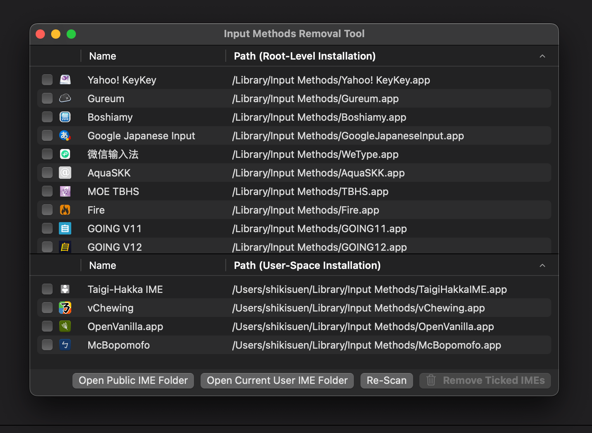

# IMRemoval

[點此閱讀本文的中文版本](docs/README.md)

The tool to help you uninstall third-party Input Methods for modern macOS, requiring at least macOS 12 Monterey.

(c) 2023 and onwards The vChewing Project (MIT License).

> Disclaimer:
> 1. This app (starting from v2.x) has no relationship with the `2008-2018 © Zonble`'s app (v1.x) which is designed for PowerPC, regardless the app names are the same. However, this repository inherits most parts of the README.md file written by Zonble to help readers know what can such kind of an app do for the users, considering that both mine and his apps are made for same purposes (regardless in different era).
> 2. This app has no malfunction behavior. At least, all releases provided in this repository are Sandboxed. Sandbox is the best weapon to crack down rumors regarding malicious software behaviors.
> 3. This app (starting from v2.x) is completely rewritten from scratch using SwiftUI. The entire backend design and UI implementation are different than Zonble's version (v1.x). Although Zonble has removed his repository from GitHub, I have kept [a backup fork](https://github.com/ShikiSuen/imremoval-zonbleBackup) from someone else.

## Introduction

> This part is written by Zonble, except some edits of mine for modern macOS. As of now, this article describes macOS 12 and later. I removed all contents related to PowerPC.

To install or uninstall an application is quite easy on macOS, what a user need to do is to drag the application bundle to their disk (or download from Mac App Store), or drag the application to the trash can. However, to install or uninstall Input Methods is difficult.

Unlike other applications, Input Methods are sputnik applications (running in either user domain or global domain): if a user want to install a new third-party Input Method software, he or she need to copy the files to the global domain installation folder `"/Library/Input Methods"` with system administrator privilege or user domain installation folder `"~/Library/Input Methods"` with no elevated privilege, and the developers may need to design a dedicated software installer for it.

To uninstall an Input Method is another pain: users are probably having no awareness of where did they install the software. If it is installed in the global domain installation folder, the system administrator privilege is required for the removal. Plus, there was no good tool to help them to find and uninstall the softwares.

The usage of IMRemoval is to list all installed third-party Input Methods in a list, users can check the Input Methods they decide not to use anymore, and what they need to do then is to click on a button. As a Sandboxed app since v2 (starting from 2023), IMRemoval can't bypass the Sandbox limitation, hence poping up the Finder window when necessary, guiding the user to remove those input methods installed in the global domain.

Input Methods are much important for users who use not only CJK languages but also some minor languages (e.g. Devangari, [Hindi](https://github.com/ratreya/lipika-ime), etc.) and so on. For instance of Chinese IME: Users need such kind of app to combine radicals or phonetics to characters, helping them input texts in their own native language. There are many kinds popular Input Methods in the areas, and the built-in ones may not satisfy their needs. People would like to try several different softwares and know what is the one that they really like.

## Requirement

To install the tool (since v2 starting from 2023), you need macOS 12 Monterey or higher.

## Build

If you want to build the application by your self, please follow the following steps (requiring Xcode 15.0, recommending Xcode 15.1 and later):

### a. You have an active Apple Developer Program membership:

1. Open `IMRemoval.xcodeproj` with Xcode.
2. Replace the code signing information to yours.
3. Click on the "Product" menu -> "Archive".
4. In the organizer, you notarize a copy and export it.
5. Done.

### b. You don't have an active Apple Developer Program membership:

1. Open `IMRemoval.xcodeproj` with Xcode.
2. Remove the code signing information or replace them to ad-hoc signatures.
3. Click on the "Product" menu -> "Run".
4. Done. You just can't share your build apps to others, as the GateKeeper on their computers will stop it from running. This is a deliberate design by Apple.

## Feedback/Contact

Any suggestion or advice is welcome. Please leave issue tickets in this repository. And, **don't contact Zonble** for bug reports towards anything in this repository: He is NOT RESPONSIBLE for the matters here.
