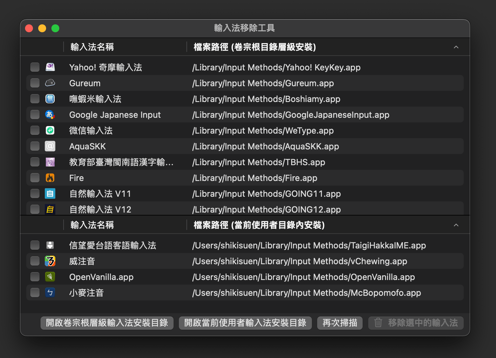

# 輸入法移除工具（IMRemoval）

該工具會幫助您卸除 macOS 系統內安裝了的第三方輸入法，可用於 macOS 12 開始的系統。

(c) 2023 and onwards The vChewing Project (MIT License).

> 免責聲明：
> 1. 該 app (特指從 2023 年的 v2.x 版開始) 與 Zonble 在 2008-2018 年間開發的 1.x 版無關，哪怕兩者的軟體職能一致。然而，該倉庫仍繼承了 Zonble 所寫的 README.md 說明檔案、以便闡明這樣一款工具軟體「能為使用者做什麼」。
> 2. 該軟體不存在有害行為。至少，從該倉庫提供的軟體發行版本均有做過 Sandbox 沙箱處理。沙箱是最好的謠言粉碎機。
> 3. 該 app (特指從 2023 年的 v2.x 版開始) 採 SwiftUI 從零開始徹底重寫。無論是在前端介面的實作方式、還是在後端邏輯層面的處理，均與 Zonble 所完成的 v1.x 版大相逕庭。雖然 Zonble 已經將他的版本的倉庫移除了，但筆者這邊找到了殘留的 fork、自己也[專門 fork 了一份](https://github.com/ShikiSuen/imremoval-zonbleBackup)留作公示對比之用途。

## 軟體功能介紹

> 該章節翻譯自 Zonble 寫的英文原版 README.MD 的介紹章節，且由筆者就 macOS 12 開始的系統的現狀做了一些符合實際情況的內容改寫。比方說 PowerPC macOS 10.4 Tiger 那種已經被淘汰的 component 形態的輸入法相關的內容就被移除了，因為 Intel Mac 就沒有這種東西（更遑論 Apple Silicon Mac）。

macOS 安裝或卸除一般的軟體的話，還是滿方便的：使用者可以藉由 Mac App Store 直接下載安裝，也可以從 dmg 鏡像當中將 App 拽到 Applications 目錄內完成安裝，還可以將 App 從 Applicatoins 目錄拽到垃圾桶內來卸除之。然而，輸入法的安裝與卸除，則是另一回事。

不似其他應用，macOS 輸入法是以衛星應用程式的形式存在的：如果要安裝一款輸入法的話，使用者可以直接複製到使用者目錄內的輸入法安裝目錄「~/Library/Input Methods」、或者持管理員權限安裝到卷宗根層級的輸入法安裝目錄「/Library/Input Methods」。開發者視情況可能得製作專用的安裝程式。

要卸除一款輸入法的話，就是另一回事了：使用者可能會不太清楚輸入法到底灌到哪裡去了。如果是卷宗根層級的輸入法安裝目錄的話，在卸除時還得需要管理員權限。再者，市面上幾乎沒有趁手的工具來幫忙打點這類工作。

敝 App 的職能就是：將系統內已經安裝了的第三方輸入法陳列出來，允許使用者勾選自己不需要的輸入法來一鍵卸除（送往垃圾桶）。因為（自這個 2023 年起的 v2 版本開始）敝 App 用到了 Sandbox，所以很多行為受到了限制，就會在這種限制被觸及的情況下主動叫出檔案總管視窗、來指引使用者怎樣親手具體操作（將安裝到卷宗根目錄層級的輸入法卸除掉）。

不只是中日韓使用者，還包括[印地語](https://github.com/ratreya/lipika-ime)在內，很多語言都是需要輸入法的。拿漢語輸入法舉例的話，使用者利用輸入法來組合字根或者讀音、藉此實現漢字輸入。系統內建的輸入法不見得始終能滿足每個使用者的需求；而副廠輸入法種類玲琅滿目，自然就會有使用者想去嘗鮮。

## 系統需求

該 app (特指從 2023 年的 v2.x 版開始) 要求至少 macOS 12 Monterey。

## 建置

可依下述步驟自行建置（需要 Xcode 15.0，建議 Xcode 15.1）：

### a. 您持有有效的 Apple 研發者會員身分：

1. 藉由 Xcode 開啟 `IMRemoval.xcodeproj`。
2. 將程式碼簽章訊息換成你自己的。
3. 點「Product」選單之後點「Archive」。
4. 自己在接下來的 Organizer 介面當中將封存檔簽名之後送交 Apple、完成公證手續。再將已被公證過的 App 匯出。
5. 完工。

### b. 您尚未持有有效的 Apple 研發者會員身分：

1. 藉由 Xcode 開啟 `IMRemoval.xcodeproj`。
2. 移除程式碼簽章訊息，或者換成 ad-hoc 簽章
3. 點「Product」選單之後點「Run」。
4. 完工。只是這樣一來，你建置的東西就只能在你這台電腦上用了。換了一台電腦的話，就會被 GateKeeper 刁難。這是 Apple 的刻意設計使然。

## 提報與聯絡

有建議或想法的話，可以在敝倉庫開工單。另外，**不要就本倉庫的任何內容向 Zonble 尋求技術協助**，因為他沒有義務管這個。